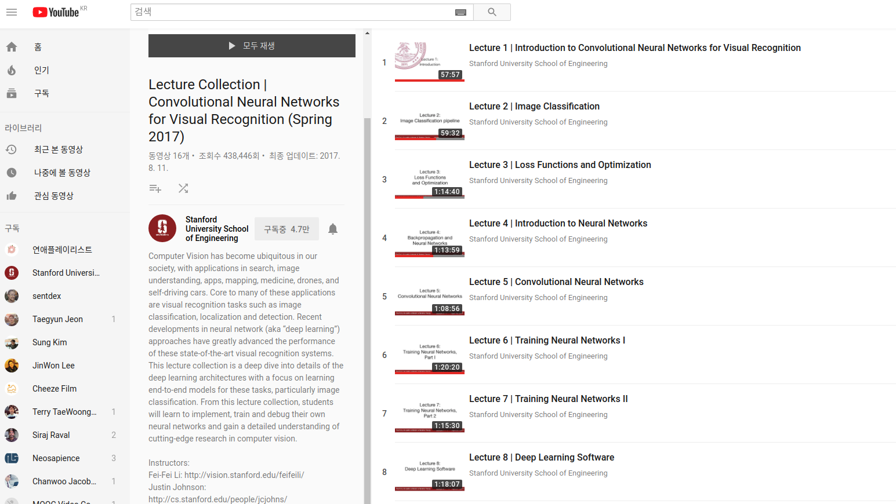

# CS231n
## about
Computer Vision has become ubiquitous in our society, with applications in search, image understanding, apps, mapping, medicine, drones, and self-driving cars. Core to many of these applications are visual recognition tasks such as image classification, localization and detection. Recent developments in neural network (aka “deep learning”) approaches have greatly advanced the performance of these state-of-the-art visual recognition systems. This lecture collection is a deep dive into details of the deep learning architectures with a focus on learning end-to-end models for these tasks, particularly image classification. From this lecture collection, students will learn to implement, train and debug their own neural networks and gain a detailed understanding of cutting-edge research in computer vision.

## 

 

## 

 

## 

 

## [Lecture slide](pdf)
